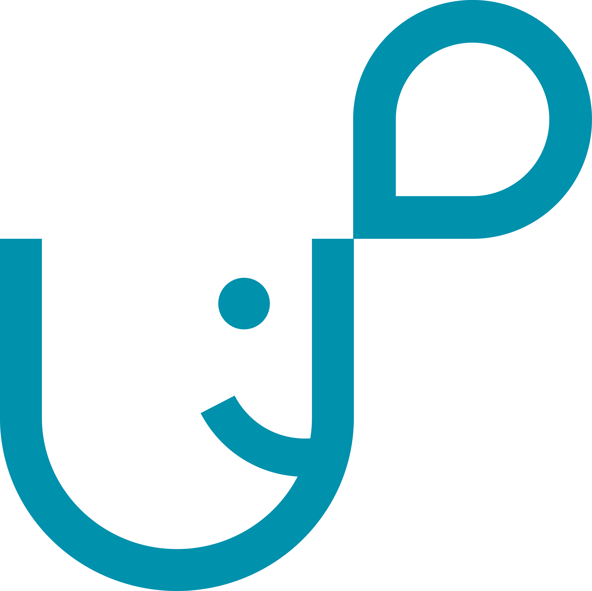

<div align="center">
    
</div>
<h1 align="center">
    Uptone
</h1>
<p align="center">
    A browser extension built for protecting users from hate speech on Twitter. Keep the web on an uplifting tone, with Uptone.
</p>

> _tldr;_ Uptone protects you from hate speech on social media by running posts through a neural network and sentiment analyzer, hiding those determined to be hateful.

## How it Works

> Browser Extension -> Backend API -> AI Model -> Browser Extension

### Browser Extension

- Parses Tweets from page, even when more Tweets are lazy loaded on scroll
- Sends a request to our backend API to receive predictions
- Hides Tweets based on settings and model predictions, and replaces them with a custom dialog that looks native to Twitter

### Backend API

- Flask webserver with a POST route that serves the neural network model and sentiment analyzer
- Automatically preprocesses input and creates predictions using the model
- Sentiment analyzer complements the model by reducing false positives

### AI Model

- Convolutional Neural Network (CNN) that categorizes Tweet text into (0 = hate speech, 1 = offensive language, 2 = neither)
- Custom Tweet preprocessor that cleans and lemmatizes text, and expands contractions/abbreviations
- Trained on https://www.kaggle.com/datasets/mrmorj/hate-speech-and-offensive-language-dataset

### Website

- Landing page made with NuxtJS and WindiCSS, designed on Figma

## Project Setup

### Browser Extension

```bash
cd extension
yarn install
yarn dev:chromium # or yarn dev:firefox
```

### Backend API

```bash
cd api
mkdir api/bin
cp <path to model> api/bin/hatespeech.bin
cp <path to tokenizer> api/bin/tokenizer.pickle
poetry install
FLASK_APP=api poetry run flask run
```

### AI Model

Follow the instructions [here](https://www.codecademy.com/article/how-to-use-jupyter-notebooks) to run the Jupyter notebook in `notebooks/hatespeech.ipynb`

### Website

```bash
cd website
yarn install
yarn dev
```
